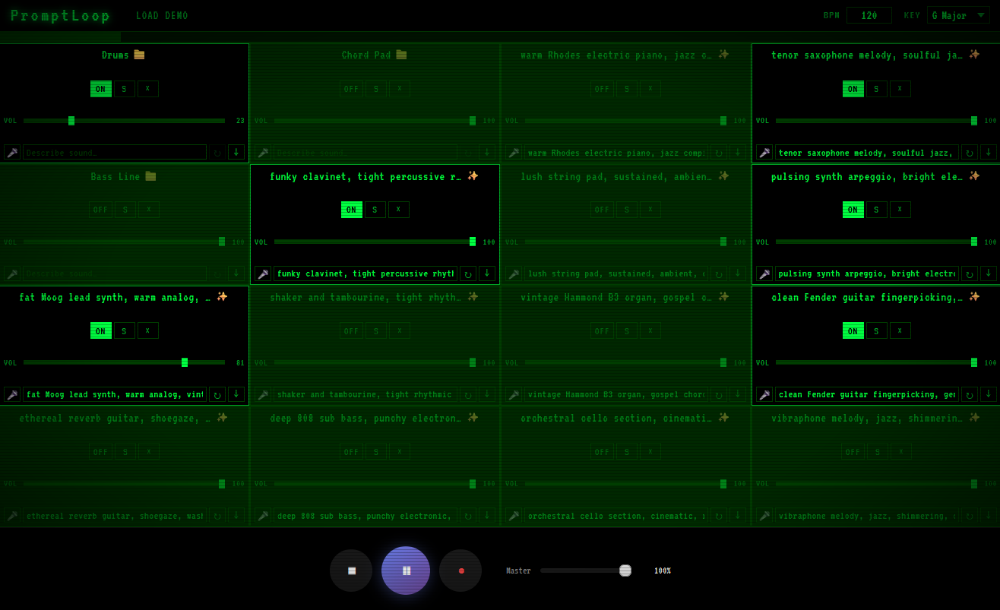

# PromptLoop

AI-powered looping pedal for live performance. Describe an instrument, hit generate, and a new loop appears on the next bar.



## How It Works

Type a prompt into any pad ("fat Moog lead synth", "tenor saxophone melody, soulful jazz") and hit ✨. The local GPU generates an audio loop matched to the current BPM and key. Generated tracks enter playback at the next loop boundary so they never clip in mid-phrase.

## Setup

### Generator Service (required for AI generation)

Runs ACE-Step 1.5 turbo on CUDA — generates ~8s loops in 5–15s on an RTX 4090.

```bash
# Inside the ACE-Step-1.5 uv environment
cd ~/dev/ACE-Step-1.5
uv pip install fastapi uvicorn soundfile
uv run python /path/to/live-guitar/generator-service/main.py
```

### Frontend

```bash
cd frontend
npm install
npm run dev
```

Open **http://localhost:5173**

### Production (Docker)

```bash
docker compose -f docker-compose.prod.yml up --build
# Opens on http://localhost:8080
```

## Features

- **16-pad looper** — sample-accurate playback via AudioWorklet, no scheduler drift
- **Local GPU generation** — ACE-Step 1.5 turbo at `http://localhost:8765`; falls back to in-browser MusicGen if the service is offline
- **Phase-locked entry** — newly loaded or unmuted pads wait for the loop boundary before entering
- **Key + BPM conditioning** — model generates in your key and tempo via explicit metadata, not text parsing
- **Per-pad volume sliders** — live mix control
- **Record / drag-and-drop / file picker** — load your own samples alongside generated ones
- **Retro CRT aesthetic** — VT323 font, phosphor green, scanline overlay

## Architecture

| Component | Description |
|---|---|
| `frontend/` | React + Vite SPA |
| `frontend/public/audio/looper-processor.js` | AudioWorklet — real-time loop engine |
| `frontend/src/services/aiGenerator.js` | GPU service client + browser worker fallback |
| `generator-service/main.py` | FastAPI wrapper around ACE-Step 1.5 turbo |

## Technologies

- **Frontend**: React, Vite, Zustand
- **Audio**: Web Audio API, AudioWorklet
- **AI (primary)**: [ACE-Step 1.5 turbo](https://github.com/ace-step/ACE-Step) via local FastAPI service
- **AI (fallback)**: [Transformers.js](https://huggingface.co/docs/transformers.js) MusicGen-small in a Web Worker
- **Infrastructure**: Docker, Nginx

## License

MIT
