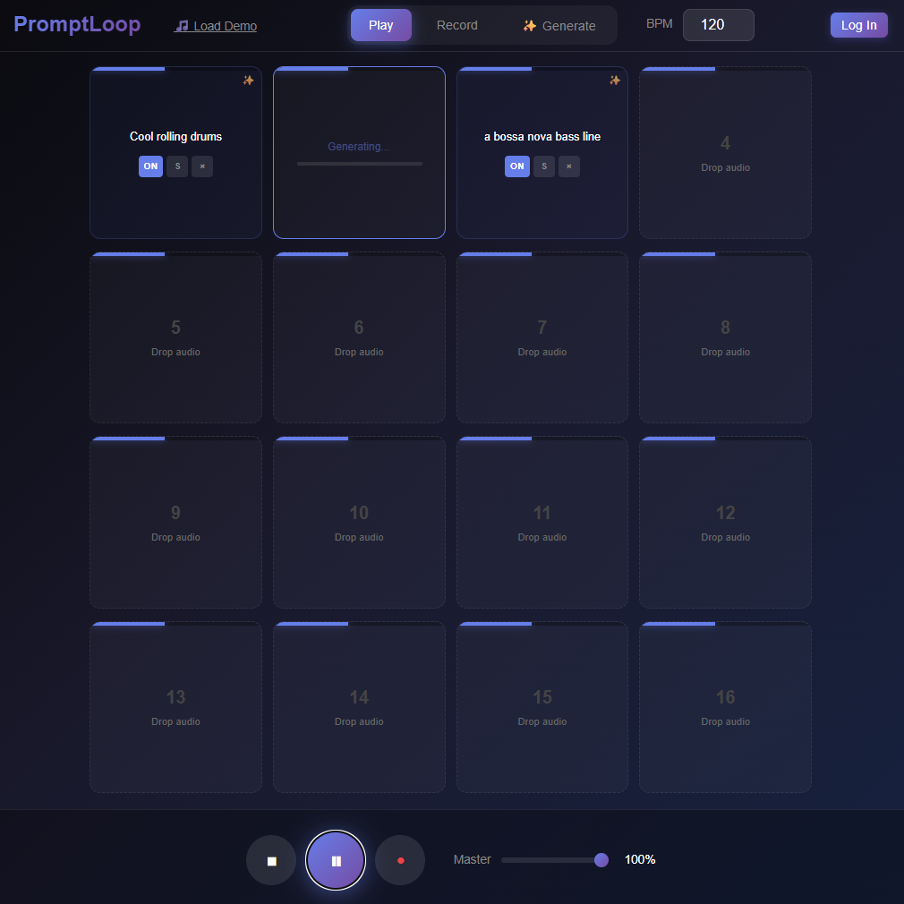

# 🎸 PromptLoop

AI-powered looping pedal and backing track generator for the web.



## Quick Start

### One-Command Docker Run

```bash
# Windows
run.bat prod

# Linux/Mac
./run.sh prod
```

Or manually:
```bash
docker compose -f docker-compose.prod.yml up --build
```

Then open **http://localhost:8080**

### Development Mode

```bash
# Frontend only (hot reload)
cd frontend && npm install && npm run dev

# Full stack with Docker
docker compose up --build
```

## Architecture

| Service          | Port | Description               |
|------------------|------|---------------------------|
| Frontend (Nginx) | 8080 | React SPA + API proxy     |
| Rails API        | 3000 | Backend REST API          |

## Technologies

- **Frontend**: React, Vite, Zustand (State Management)
- **Audio Processing**: Web Audio API, AudioWorklet (Low-latency looping)
- **AI/ML**: [Transformers.js](https://huggingface.co/docs/transformers.js) (MusicGen-small running in a Web Worker)
- **Backend**: Ruby on Rails (API mode)
- **Infrastructure**: Docker, Nginx, Supervisord

## Features

- � **16-Pad Looper** - Zero-latency looping powered by custom AudioWorklet
- 🤖 **Client-Side AI** - Generate backing tracks directly in your browser (no GPU server required!)
- 🎙️ **Multimodal Generation** - Use existing pads as context for new AI generations
- 🎨 **Modern Interface** - Responsive design with keyboard accessible controls

## License

MIT
